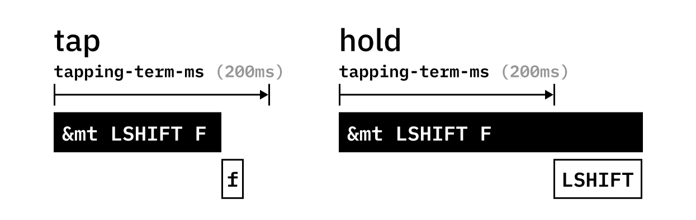
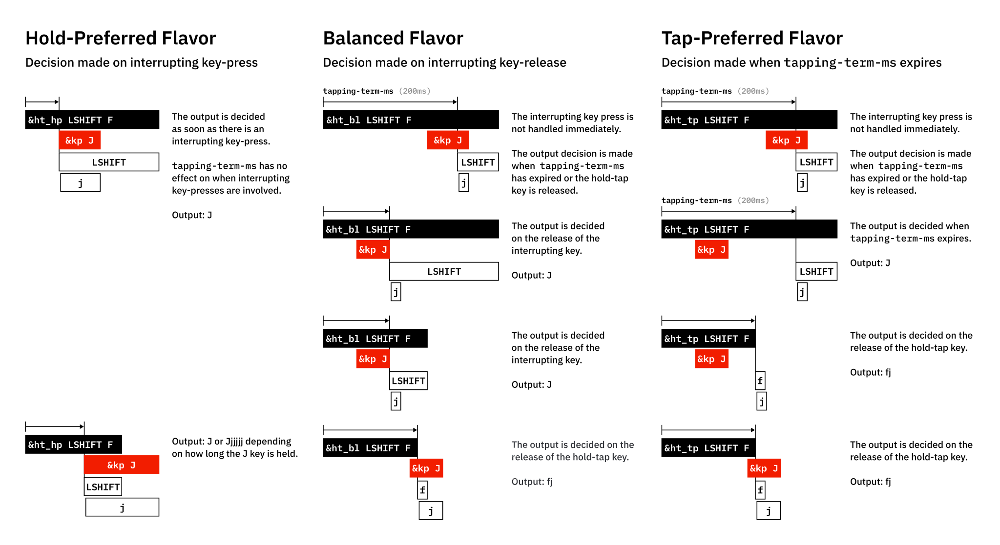

<!--vim: ts=4 sw=4 sts=4 et -->

# Keymapping for the Kinesis Advantage 360 Pro with ZMK

-   the kineses advantage 360 pro (henceforth "the keyboard" or "the kb") is a split keyboard with left and right sides

## Syntax Hints

-   to remove a property that defaults to enabled, prepend the property with `/delete-property/`
-   here is an example of property disabling with sticky key (`&sk`), which by default has  `ignore-modifiers` enabled
```

&sk {
    release-after-ms = <2000>;
    // quick-release; // property default is disabled if not explicitly listed
    ignore-modifiers; // property default is enabled 
}

&sk {
    release-after-ms = <2000>;
    quick-release; // property is now enabled
    /delete-property/ ignore-modifiers; // property is now disabled
}

```

---

## Behaviors

### Sticky Key

-   here is an example of all sticky key properties

```
skq: sticky_key_quick_release {
    compatible = "zmk,behavior-sticky-key";
    #binding-cells = <1>;
    bindings = <&kp>;
    release-after-ms = <1000>; // how long the sk is on before turned off
    //
    quick-release; // default = disabled, list to enable
    // default sk is active until next key has been pressed and released.
    // quick-release changes this to the sk being deactivated after next key pressed
    // quick-release is good for fast typing
    //
    ignore-modifiers; // default = enabled, use prepend `/delete-property/ to disable`
    // this lets you stack sk. 
    // if you want to use modifers like `&sk LS(ALT)` you need this enabled 
    //
    lazy; // default = disable, list for enable
    // default sk are activated on press until another key is pressed
    // enable lazy to not activate sk until the next key is pressed
    // this could help with mouse movement, so the mouse does not have the sk active
    // tapping a lazy sk will not trigger other behaviors e.g. release of other sk or layer
    // to make a lazy sk trigger those release behaviors: 
    //     wrap the sk in a macro that presses the release of the sticky behavior around your sk press or triggering a tap of a key like K_CANCEL
    
};
```


### Hold-Tap (ht)

-   hold-tap Behavior is divided into mod-tap and layer-tap, but the function is essentially the same.
-   in hold-tap definitions, the first `<&kp>` is the hold, and second is the tap
-   stock zmk defines two ht behaviors:
-   mod-tap `&mt` for modifier keys
    -   for mod-tap, default flavor is `hold-preferred`
    -   mt can be implemented "inline" with just `&mt LSHIFT A` where `LSHIFT` is the hold, and `A` is the tap
-   layer-tap `&lt` for (usually) `&mo` layers
    -   for layer-tap, default flavor is `tap-preferred`




-   here is an example hold-tap behavior with all properties listed

```
hm: homerow_mods {
    label = "HOMEROW_MODS";
    // ====== init
    compatible = "zmk,behavior-hold-tap";
    #binding-cells = <2>; // probably is always 2
    //
    // ====== timing properties
    tapping-term-ms = <200>; // time to trigger hold, this needs to be largest timing prop
    //
    quick-tap-ms = <150>; // default disabled
    // timespan where pressing the same hold-tap key again triggers a second press
    // useful for keys like bspc, where you may tap then hold quickly to delete
    //
    require-prior-idle-ms = <0>; // prevent hold during fast typing (default = <0>)
    //
    // ====== interupt flavor
    flavor = "tap-preferred"; // 
    //
    // ====== behavior bindings
    bindings = <&kp>, <&kp>; // the first binding is the hold behavior
    //
    // ====== special behaviors
    hold-trigger-key-positions = <1 2 3>; // default: not set 
    hold-trigger-on-release; // default: not set (false)
    hold-while-undecided; // defaut: not set (false) | holds modifier immediately on press (bad for fast typing)
    hold-while-undecided-linger; // defaut: not set (false) | continues hold during sticky key transition (no effect on typing speed)
    //
    retro-tap; // defaut: not set (false) | tap on release if not interupted
};

```

#### Hold-Tap Interrupt Flavors

-   `hold-preferred` flavor triggers the hold behavior when the `tapping-term-ms` has expired or another key is pressed.
-   `balanced` flavor will trigger the hold behavior when the `tapping-term-ms` has expired or another key is pressed and released while the hold-tap is held.
-   `tap-preferred` flavor triggers the hold behavior when the `tapping-term-ms` has expired. Pressing another key within tapping-term-ms does not affect the decision.
-   `tap-unless-interrupted` flavor triggers a hold behavior only when another key is pressed before tapping-term-ms has expired. It triggers the tap behavior in all other situations. Note that this flavor inverts the decision logic with respect to the tapping term.



#### Hold-Tap Limitations

-   the hold-tap behavior has some limitations 
    -   the hold behavior cannot roll directly into a &sk modifier
    -   you can get around this by putting a &sk inside of a macro
        -   but that will prevent stacking &sk modifiers


### Mod-Morph

-   here is an example of stacked mod-morph. 
-   when `&morph_ABC` is pressed, it will output `A` by default.
-   when `&morph_ABC` is pressed with shift, it will output `B`, and if pressed with shift and control, it will output `C`

```
morph_BC: morph_BC {
    compatible = "zmk,behavior-mod-morph";
    #binding-cells = <0>;
    bindings = <&kp B>, <&kp C>; // first term is the no-mod tap
    mods = <(MOD_LCTL|MOD_RCTL)>; // modifers this is active for
};
morph_ABC: morph_ABC {
    compatible = "zmk,behavior-mod-morph";
    #binding-cells = <0>;
    bindings = <&kp A>, <&morph_BC>;
    mods = <(MOD_LSFT|MOD_RSFT)>;
};
// this is an example with the keep-mods property
bspc_del: backspace_delete {
    compatible = "zmk,behavior-mod-morph";
    #binding-cells = <0>;
    bindings = <&kp BACKSPACE>, <&kp DELETE>;
    mods = <(MOD_LSFT|MOD_RSFT)>;
    keep-mods = <(MOD_RSFT)>; // default = 0 i.e. not active
    // keep-mods keeps modifers active and applied to the mod behavior
    // in this example, a normal press is BSP, LS(BSP) = DEL, and RS(BSP) = RS(DEL)
};
```

-   Note that Krabiner-Elements will cause problems on MacOS
-   disable "Modify Events" in Karabiner-Elements to stop the interference


### Tap-Dance


---


## Advantage 360 Details

### Key Positions/Numbers

-   the kineses advantage 360 pro is a split keyboard with left and right sides
-   for the purposes of zmk, the key positions/numbers are in the code block below
-   the keyboard has thumb clusters, one on each side. 
    -   the left thumb cluster contains key numbers 35, 36, 52, 65, 66, 67
    -   right cluster: 37, 38, 53, 68, 69, 70

```
keynums {
bindings = <
// |---------- left ---------------|-------------- right -----------|
    00 01 02 03 04 05 06           :            07 08 09 10 11 12 13
    14 15 16 17 18 19 20           :            21 22 23 24 25 26 27
    28 29 30 31 32 33 34    35 36  :  37 38     39 40 41 42 43 44 45
    46 47 48 49 50 51          52  :  53           54 55 56 57 58 59
    60 61 62 63 64       65 66 67  :  68 69 70        71 72 73 74 75
//                      |--- thumb clusters --| 
>;
};
```

